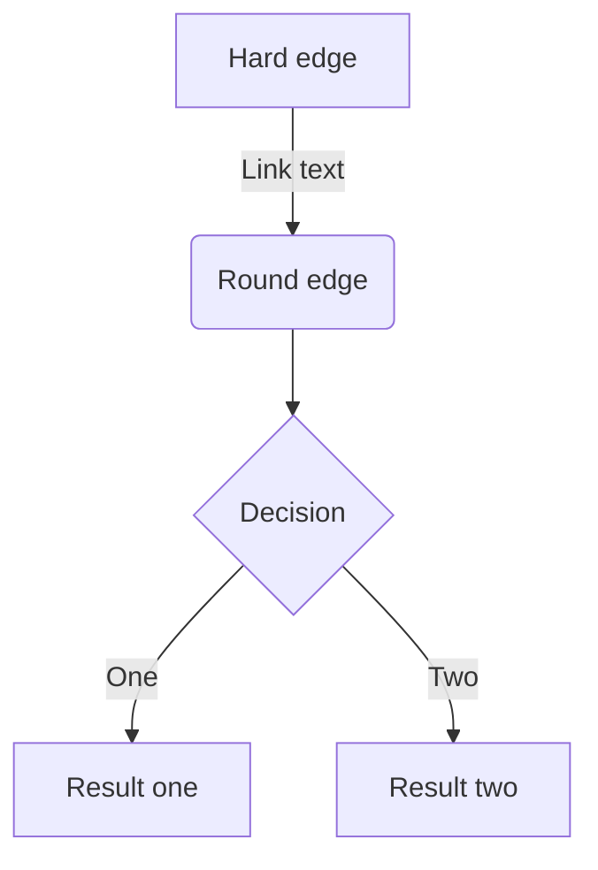

- Hello!
- Hola!
  - Bonjour!
  * Hi!

1. First
2. Second
1. third

| Head | Head | Head |
| ---- | ---- | ---- |
| Text | Text | Text |
| Text | Text | Text |


```py:csv to md
import csv
import os

folder_path = '/Users/satoureiji/Library/CloudStorage/GoogleDrive-kasyarudaora@gmail.com/マイドライブ/dev/Life/List'
input_file = os.path.join(folder_path, "レストランリスト.csv")
output_file = os.path.join(folder_path, "レストランリスト.md")

# Open the CSV file for reading
with open(input_file, 'r', encoding="utf_8_sig") as csv_file:
    reader = csv.reader(csv_file)
    data = list(reader)

# Open the markdown file for writing
with open(output_file, 'w') as md_file:
    # Write the table header
    md_file.write('|' + '|'.join(data[0]) + '|\n')
    md_file.write('|' + '|'.join(['---' for _ in range(len(data[0]))]) + '|\n')

    # Write each row of data as a row in the table
    for row in data[1:]:
        md_file.write('|' + '|'.join(row) + '|\n')

```

$$
e^{i\theta} = \cos\theta + i\sin\theta
$$

-----

*イタリック*
**太字**
~~打ち消し線~~
インラインで`code`を挿入する

<!-- TODO: ◯◯について追記する -->

:::message
メッセージをここに
:::

:::message alert
警告メッセージをここに
:::

:::details タイトル
表示したい内容
:::

::::details タイトル
:::message
ネストされた要素
:::
::::

https://zenn.dev/zenn/articles/markdown-guide

https://twitter.com/jack/status/20

https://github.com/octocat/Hello-World/blob/master/README

https://github.com/octocat/Spoon-Knife/blob/main/README.md#L1-L3

